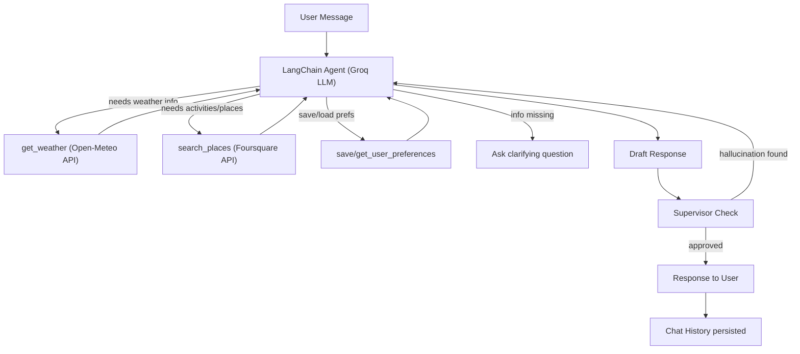

# Trip Planner AI

An intelligent trip location planning agent built with LangChain, LangGraph, and Streamlit. The agent helps users discover travel destinations by reasoning about their preferences, checking climate data, finding activities and attractions, and remembering preferences across chat sessions.

## Architecture



### How It Maps to Navan Cognition Concepts

| Navan Cognition | This Project |
|---|---|
| Agent Dispatcher + Cognition Alignment | System prompt with domain expertise + LLM-driven tool selection |
| Supervisor (hallucination checks) | Post-response validation against tool evidence |
| API Fulfillment | Real APIs (Open-Meteo, Foursquare) as source of truth |
| Cognitive Decline Prevention | Chat history + long-term memory prevent context loss |
| LLM Agnostic Design | Uses `init_chat_model` — swap model/provider in one line |

### Key Design Decisions

- **LLM decides tool usage**: The agent autonomously decides which tools to call based on the user's message — no rigid routing logic.
- **Missing info detection**: The system prompt instructs the agent to ask for missing details (dates, budget, preferences) before making tool calls.
- **Supervisor as post-check**: A lightweight LLM call validates the response against tool evidence. If fabricated data is detected, the agent regenerates (max 1 retry).
- **Self-correction**: Tool errors are surfaced to the LLM which retries with alternatives. Supervisor rejections trigger re-generation.

## Tech Stack

- **Agent Framework**: LangChain `create_agent` + LangGraph
- **LLM**: Groq (Llama 3.1 8B Instant) — free tier
- **Weather Data**: Open-Meteo API — free, no API key
- **Places Data**: Foursquare Places API — free tier
- **UI**: Streamlit
- **Memory**: InMemorySaver (chat history) + InMemoryStore (user preferences, in-memory — resets on app restart)

## Setup

### 1. Clone and install

```bash
git clone <repo-url>
cd Trip_Recommend_Agent
pip install -r requirements.txt
```

### 2. Get API keys (free)

- **Groq**: Sign up at [console.groq.com](https://console.groq.com), create an API key
- **Foursquare**: Sign up at [foursquare.com/developers](https://foursquare.com/developers), create a project, get your API key

### 3. Configure

Copy `.env.example` to `.env` and fill in your keys:

```bash
cp .env.example .env
```

```
GROQ_API_KEY=your_groq_key_here
FOURSQUARE_API_KEY=your_foursquare_key_here
```

### 4. Run

```bash
streamlit run app.py
```

## Features

### Core (Assignment Requirements)

- **Agentic Logic**: ReAct-style reasoning — the agent plans which tools to call and executes them
- **Tool Use**: Two real external APIs (Open-Meteo weather + Foursquare places)
- **Self-Correction**: Tool errors trigger retries; supervisor catches fabricated data and forces regeneration

### Bonus

- **Long-Term Memory**: User preferences (travel style, interests, dietary needs) persist across chat sessions within a single app run
- **Chat History**: Full conversation context maintained — follow-up questions work naturally
- **Polished UI**: Streamlit app with onboarding flow, chat interface, and custom styling

## Project Structure

```
Trip_Recommend_Agent/
├── app.py                 # Streamlit entry point + onboarding
├── agent.py               # Agent setup, system prompt, invoke logic
├── supervisor.py          # Post-response hallucination check
├── logger.py              # Structured terminal logging
├── config.py              # Configuration + env vars
├── requirements.txt
├── .env.example
├── tools/
│   ├── weather.py         # Open-Meteo weather tool
│   └── places.py          # Foursquare places tool
└── ui/
    ├── components.py      # Reusable UI components
    └── styles.py          # Custom CSS
```

## Terminal Logging

The app prints structured, color-coded logs to the terminal for debugging:

```
═══════════════════════════════════════════════════════
  [USER MESSAGE] "I want to go skiing in January"
═══════════════════════════════════════════════════════

  [LLM RESPONSE] "Sounds fun! Where are you thinking of going?..."
    Duration: 1200ms

═══════════════════════════════════════════════════════
  [USER MESSAGE] "Innsbruck"
═══════════════════════════════════════════════════════

  [TOOL CALL] get_weather
    Input:  {"city": "Innsbruck", "country": "Austria", "month": 1}
    Output: Weather for Innsbruck, Austria in January: Avg Temp: -2.3°C...
    Duration: 400ms

  [TOOL CALL] search_places
    Input:  {"city": "Innsbruck", "category": "ski resort"}
    Output: Top ski resort in Innsbruck, Austria: 1. Nordkette...
    Duration: 600ms

  [LLM RESPONSE] "Great choice! Innsbruck in January is perfect..."
    Duration: 2100ms

  [SUPERVISOR] Checking response against tool data...
    Verdict: PASS
    Duration: 800ms

  Total request time: 3900ms
───────────────────────────────────────────────────────
```

## Demo Walkthrough

1. **Start**: Enter your home city (e.g., "Tel Aviv, Israel") — validated against Open-Meteo geocoding
2. **Ask**: "I want to go skiing" — agent detects missing info, asks when you want to go
3. **Provide details**: "January" — agent checks weather at ski destinations, finds activities via Foursquare
4. **Follow up**: "What about nightlife in Innsbruck?" — uses chat history for context
5. **Change mind**: "Actually somewhere warmer" — re-queries tools for warm destinations
6. **New chat**: Agent remembers your preferences from earlier in the session
